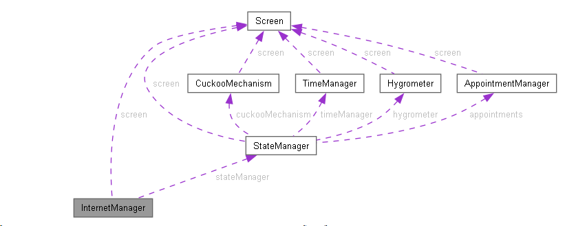

# Code

!!! note
    All the code can be found on
    [GitLab](https://gitlab.fdmci.hva.nl/IoT/2023-2024-semester-1/individual-project/iot-koulenf){:target="_blank"}.

## Table of Contents

* [Introduction](#introduction)
* [Components](#components)
    * [Classes](#classes)
    * [Other files](#other-files)
* [Main Code](#main-code)
* [Libraries](#libraries)
* [Compiling the code](#compiling-the-code)

## Introduction

The embedded device is written in Arduino & C++ and uses the Arduino framework. The code is split up into multiple
files. The main file is responsible for initializing all the components and running the main loop. The main loop checks
for button presses, listens to incoming requests and updates the display. The other files are responsible for the logic
of the components.

## Components

### Classes

The embedded device consists of 7 classes.

This diagram shows the classes of the embedded device and how they interact with each other.

<figure markdown>
  
  <figcaption>The purple arrows indicate that the class uses the class that is pointed to.</figcaption>
</figure>

In the diagram, the classes are represented by boxes. The arrows indicate that the class that the arrow points to is
used by the class that the arrow starts from. For example, the `StateManager` class uses the `Screen` class, because it
needs to update the screen. The `Screen` class does not use the `StateManager` class, because it does not need to know
about the state of the embedded system.

The classes are described in the list below. Feel free to click on the class name to go to the documentation of that
class and read more about it.

* **class [AppointmentManager](/2023-2024-semester-1/individual-project/iot-koulenf/embedded/class_appointment_manager/)** <br>Represents an appointment manager that is responsible for fetching, storing and displaying appointments.
* **class [CuckooMechanism](/2023-2024-semester-1/individual-project/iot-koulenf/embedded/class_cuckoo_mechanism/)** <br>Represents a mechanism for controlling a cuckoo clock.
* **class [HTTPSClient](/2023-2024-semester-1/individual-project/iot-koulenf/embedded/class_h_t_t_p_s_client/)** <br>Contains a static method to get a WiFiClientSecure object.
* **class [Hygrometer](/2023-2024-semester-1/individual-project/iot-koulenf/embedded/class_hygrometer/)** <br>Represents a hygrometer that measures the temperature and humidity of the air.
* **class [InternetManager](/2023-2024-semester-1/individual-project/iot-koulenf/embedded/class_internet_manager/)** <br>Represents a manager that handles the internet connection and sets up a web server.
* **class [Screen](/2023-2024-semester-1/individual-project/iot-koulenf/embedded/class_screen/)** <br>Represents the screen of the device.
* **class [StateManager](/2023-2024-semester-1/individual-project/iot-koulenf/embedded/class_state_manager/)** <br>Represents the manager for the state of the embedded system.
* **class [TimeManager](/2023-2024-semester-1/individual-project/iot-koulenf/embedded/class_time_manager/)** <br>Represents the manager for displaying the time and date and converting UTC time to local time.
    * **class [DateTime](/2023-2024-semester-1/individual-project/iot-koulenf/embedded/class_time_manager_1_1_date_time/)** <br>Represents the date and time in a readable format.

### Other files

**[Constants.h](https://gitlab.fdmci.hva.nl/IoT/2023-2024-semester-1/individual-project/iot-koulenf/-/blob/main/embedded/main/Constants.h?ref_type=heads){:target="_blank"}**
The constants file contains constants that are necessary for the project configuration, such as the pins used for the
different components and the Wi-Fi credentials.

**[Pitches.h](https://gitlab.fdmci.hva.nl/IoT/2023-2024-semester-1/individual-project/iot-koulenf/-/blob/main/embedded/main/Pitches.h?ref_type=heads){:target="_blank"}**

The pitches file contains all the pitches that the buzzer can play.

## Main Code

The main code is responsible for initializing all the components and running the main loop. It is the starting point of
the embedded device.

Please check the code below to see how the components are initialized and how the main loop works.

```cpp title="main.ino"
/**
 * Main file for the embedded system.
 * This file is responsible for initializing all the components and running the main loop.
 * The main loop checks for button presses, listens to incoming requests and updates the display.
 *
 * @author F.S. Koulen
 * @details License: GNU GPLv3
 */

#include "Constants.h"
#include "StateManager.h"
#include "Screen.h"
#include "InternetManager.h"
#include "TimeManager.h"
#include "Hygrometer.h"
#include "AppointmentManager.h"
#include "CuckooMechanism.h"

// Initialize all the components
Screen *screen = new Screen();
ThreeWire rtcWiring(RTC_DAT_PIN, RTC_CLK_PIN, RTC_RST_PIN);
TimeManager timeManager = TimeManager(rtcWiring);
DHT dht(DHT_PIN, DHT_TYPE);
Hygrometer hygrometer = Hygrometer(dht);
AppointmentManager appointments = AppointmentManager();
CuckooMechanism cuckooMechanism = CuckooMechanism();
StateManager *stateManager = new StateManager(screen, cuckooMechanism, timeManager, hygrometer, appointments);
InternetManager *internetManager = new InternetManager();

/**
 * Initialize the components and set up the serial connection.
 */
void setup() {
    pinMode(NEXT_BUTTON_PIN, INPUT);
    Serial.begin(SERIAL_BAUD_RATE);
    Serial.println(); // Print empty line to separate boot messages from the rest of the output
    screen->initializeLCD();
    internetManager->initialize(screen, stateManager);
    stateManager->initialize(screen);
}

/**
 * Listen for requests to the server, check for button presses, if the cuckoo mechanism should be activated,
 * if the display should be updated and if the time display should be shown.
 */
void loop() {
    internetManager->listenServer();
    stateManager->checkToActivateCuckooMechanism();
    stateManager->checkToGoBackToTimeDisplay();
    stateManager->checkToUpdateDisplay();
    stateManager->checkButtonPress();
} 
```

## Libraries

The following libraries are used in this project. They are all available through the Arduino IDE's library manager.
Please install them before compiling the project.

| Library                                                                                           | Version | Description                                                                       |
|---------------------------------------------------------------------------------------------------|---------|-----------------------------------------------------------------------------------|
| [ArduinoJson](https://arduinojson.org/)                                                           | 6.21.3  | A library for parsing JSON data.                                                  |
| [RTC](https://www.arduino.cc/reference/en/libraries/rtc-by-makuna/)                               | 2.4.2   | A library for using the RTC module.                                               |
| [Adafruit Unified Sensor](https://www.arduino.cc/reference/en/libraries/adafruit-unified-sensor/) | 1.1.13  | A library for using sensors.                                                      |
| [Adafruit DHT Sensor Library](https://www.arduino.cc/reference/en/libraries/dht-sensor-library/)  | 1.4.4   | A library for using the DHT sensor.                                               |
| [WiFiManager](https://github.com/tzapu/WiFiManager)                                               | Master  | A library for managing the Wi-Fi connection.                                      |
| [LiquidCrystal_I2C](https://reference.arduino.cc/reference/en/libraries/liquidcrystal-i2c/)       | 1.1.4   | A library for using the LCD screen through the backpack.                          |
| [ezTime](https://www.arduino.cc/reference/en/libraries/eztime/)                                   | 0.9.3   | A library for retrieving the time through the internet and timezone compatibility |

## Compiling the code

To compile the code, please follow the steps below.

1. Clone the repository.
2. Open the main file in the Arduino IDE (embedded/main/main.ino).
3. Install the libraries mentioned in the [Libraries](#libraries) section.
4. Select the correct board and port in the Arduino IDE.
5. Change the constants in Constants.h to your liking.
6. Click on the upload button in the Arduino IDE.
7. The code should now be uploaded to the embedded device.

!!! note
    The board should be connected to the computer through USB and should be recreated from the [Wiring Diagram](http://127.0.0.1:8000/embedded/technical_documentation/#wiring-diagram).

--- 

[Back to top](#code)