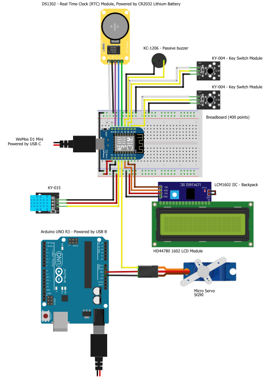

# Technical Documentation

## Wiring Diagram

To recreate my embedded device, you can use the following wiring diagram as a reference. The wiring diagram visually
represents how the different components are connected in the circuit. On the left there is a table that describes the
function of each wire color. The wires are color coded to make it easier to follow the diagram.

On the right side of the diagram, there is a visual representation of the circuit. The diagram was created
using [Fritzing](https://fritzing.org/). The diagram is also available as
a [Fritzing file](../assets/embedded/technical_documentation/fritzing.fzz)
with [parts](../assets/embedded/technical_documentation/parts.fzbz).

<figure class="inline" markdown>

| Wire Color | Function |
|------------|----------|
| Red        | 5V       |
| White      | 3.3V     |
| Black      | GND      |
| Yellow     | Data     |
| Purple     | Clock    |
| Blue       | Data     |
| Green      | Reset    |
| Orange     | SDA      |
| Brown      | SCL      |

</figure>

<figure class="" markdown>
  
</figure>

## Bill of Materials

The following table lists all the components that were used to create the embedded device. For each component, the table
includes the part number, the manufacturer, a description of the component, the quantity used, the price for one unit,
the subtotal for the quantity used, a link to an example distributor, and a link to the datasheet for the component. The
datasheet contains more detailed information about the component.

| Part Number     | Manufacturer                                | Description                                                                                | Quantity | Price (incl. VAT) | Subtotal (incl. VAT) | Example URL                                                                         | Datasheet URL                                                                                                                                                                                           |
|-----------------|---------------------------------------------|--------------------------------------------------------------------------------------------|----------|-------------------|----------------------|-------------------------------------------------------------------------------------|---------------------------------------------------------------------------------------------------------------------------------------------------------------------------------------------------------|
| D1_mini         | LOLIN                                       | LOLIN D1 Mini V4.0.0, A mini wifi board with 4MB flash based on ESP-8266EX.                | 1        | €4.45             | €4.45                | [AliExpress](https://www.aliexpress.com/item/32529101036.html)                      | [WeMos D1 Mini Datasheet](https://www.wemos.cc/en/latest/d1/d1_mini.html)                                                                                                                               |
| A000066         | Arduino                                     | Arduino Uno, microcontroller board based on the ATmega328P                                 | 1        | €24.00            | €24.00               | [Arduino Store](https://store.arduino.cc/products/arduino-uno-rev3)                 | [Arduino UNO R3 Datasheet](https://docs.arduino.cc/resources/datasheets/A000066-datasheet.pdf)                                                                                                          |
| ET1184          | Shenzhen Eshinede Technology Co., Ltd.      | Quality mini bread board Solderless Plug-in Breadboard  8.5CM x 5.5CM 400 holes tie-points | 1        | €3.99             | €3.99                | [AZ-Delivery](https://www.az-delivery.de/en/products/mini-breadboard)               | [Breadboard Datasheet](https://cdn.shopify.com/s/files/1/1509/1638/files/Mini-Breadboard_Datenblatt_AZ-Delivery_Vertriebs_GmbH.pdf?v=1677685210)                                                        |
| KC-1206         | KINGSTATE                                   | Piezo Buzzer                                                                               | 1        | €0.195            | €0.195               | [AliExpress](https://www.aliexpress.com/item/32827783457.html?gatewayAdapt=glo2nld) | [KC-1206 Datasheet](https://datasheetspdf.com/pdf-file/703460/KINGSTATE/KC-1206/1)                                                                                                                      |
| DS1302          | Shenzhen Jiaqisheng Electronics Co., LTD    | Real-time clock module                                                                     | 1        | €4.49             | €4.49                | [AZ-Delivery](https://www.az-delivery.de/en/products/rtc-modul)                     | [DS1302 Datasheet](https://cdn.shopify.com/s/files/1/1509/1638/files/RTC_Modul_DS1302_Datenblatt.pdf?8928381233112351030)                                                                               |
| KY-004          | Shenzhen Crownhaosheng Technology Co., Ltd. | Push button module                                                                         | 2        | €2.99             | €5.98                | [AZ-Delivery](https://www.az-delivery.de/en/products/button-modul)                  | [KY-004 Datasheet](https://cdn.shopify.com/s/files/1/1509/1638/files/Button_Modul_Datenblatt.pdf?532653108151546991)                                                                                    |
| KY-015          | Shenzhen Crownhaosheng Technology Co., Ltd. | Temperature and humidity sensor module                                                     | 1        | €4.49             | €4.49                | [AZ-Delivery](https://www.az-delivery.de/en/products/dht-11-temperatursensor-modul) | [KY-015 Datasheet](https://cdn.shopify.com/s/files/1/1509/1638/files/DHT_11_Temperatursensor_Modul_Datenblatt_a59ef62a-ee56-4c72-918f-00cb97f71f64.pdf?16953870400002276923)                            |
| LCD1602         | Shenzhen Hongshuyuan Technology Co.,Ltd.    | LCD display module                                                                         | 1        | €5.49             | €5.49                | [AZ-Delivery](https://www.az-delivery.de/en/products/16x2-lcd-blaues-display)       | [HD44780 1602 Datasheet](https://cdn.shopify.com/s/files/1/1509/1638/files/HD44780_1602_Blaues_LCD_Display_Datenblatt_AZ-Delivery_Vertriebs_GmbH_6b261ba0-ce77-4bbd-82a7-a9c3c417c348.pdf?v=1606233091) |
| I2C IIC Adapter | Shenzhen Miduomei Technology Co., Ltd.      | 	IIC I2C Serial Interface Adapter Board for 1602 LCD Module                                | 1        | €3.99             | €3.99                | [AZ-Delivery](https://www.az-delivery.de/en/products/serielle-schnittstelle)        | [I2C IIC Adapter Datasheet](https://cdn.shopify.com/s/files/1/1509/1638/files/Serielle_Schnittstelle_I2C_fur_LCD_Displays_Datenblatt.pdf?1765968751774050831)                                           |
| SG90            | Okystar Technology Co., Ltd.                | Servo 180 Degree 9G Micro Servo Motor SG90                                                 | 1        | €5.79             | €5.79                | [AZ-Delivery](https://www.az-delivery.de/en/products/az-delivery-micro-servo-sg90)  | [SG90 Datasheet](https://cdn.shopify.com/s/files/1/1509/1638/files/Micro_Servo_SG90_Datenblatt.pdf?17879403308522525661)                                                                                |

