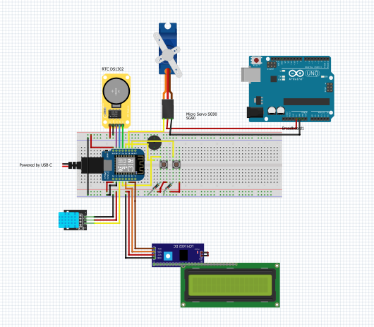
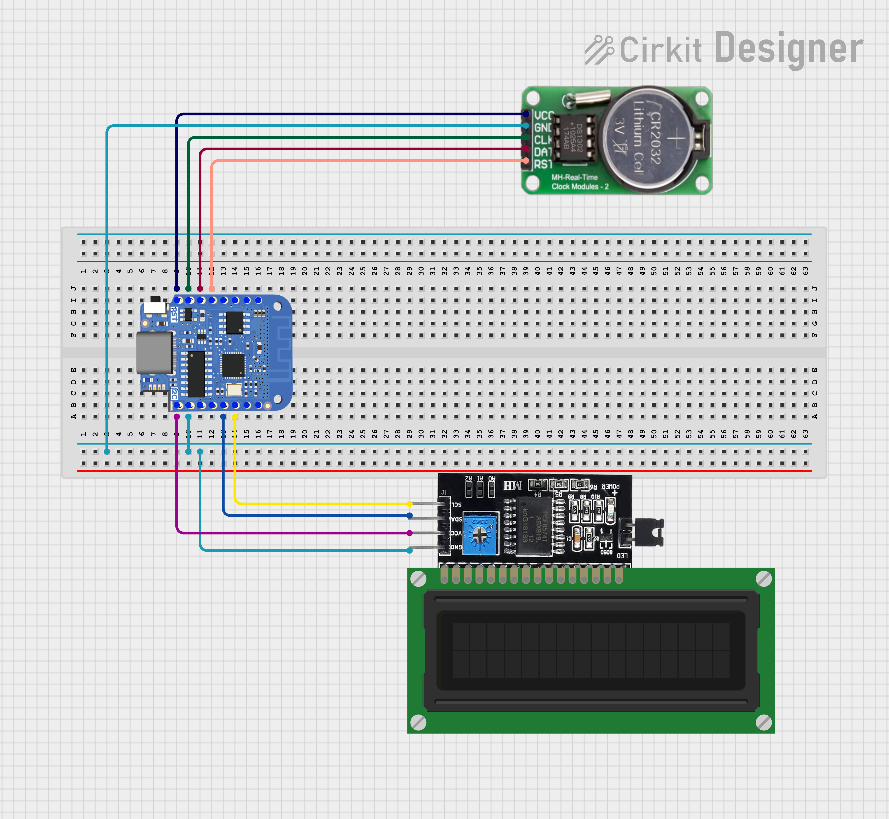
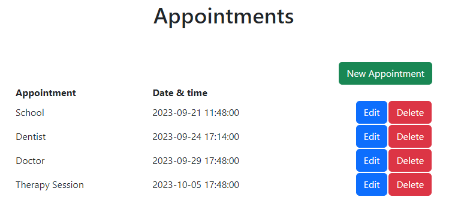
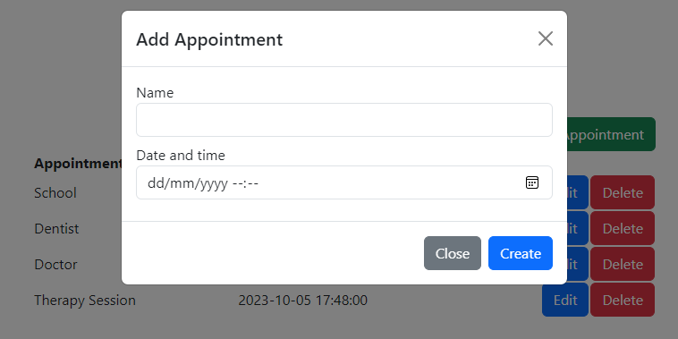
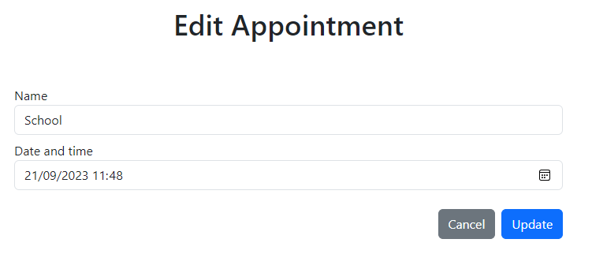

# Learning Journal

> Your learning journal can be seen as a diary of your learning process. It is a place where you can reflect on your
> learning, and where you can keep track of your progress. It is also a place where you can keep track of your
> questions,
> and where you can write down your answers to those questions.

> So for example when you receive feedback on your project, you can write down the feedback and your reflection on it in
> your learning journal. You can also write down what you have learned from the feedback, and how you will apply it in
> your project.

# Q & A

| Date       | Question                                                                | Answer                                                                                                                                                                                                                        |
|------------|-------------------------------------------------------------------------|-------------------------------------------------------------------------------------------------------------------------------------------------------------------------------------------------------------------------------|
| 2023-09-21 | Are we allowed to use existing STL files for our 3D printed product?    | Yes, make sure to credit it and explain why you have chosen to use this. - Mats                                                                                                                                               |
| 2023-09-21 | Should we test (as in write test cases) and deploy our websites online? | For testing, use the simplest form; so test manually and describe how you've done it. For the deployment part; you do not need to deploy the application. However, make sure to write down how to set up your project. - Mats |
| 2023-09-28 | What do you need to do for EMBRQ#05                                     | Check this out: https://github.com/tzapu/WiFiManager - Mats                                                                                                                                                                   |

# Week 5

### Thursday (5th of October)

* Listened to Wilko's course, Business and Trends
* Helped two peer students with their REST API
* Figured out how to fix the button that is connected to GPIO 0. I had to connect the VVC to the button through the 10k
  resistor and then connect the button to ground. GPIO 0 Is always pulled high, so when the button is pressed, it will
  pull the pin low. This is called a pull-down resistor.
* Created endpoint for latest measurement
* Retrieved latest measurement from API in front-end
* Displayed the latest measurement on the site
* Fixed bug where "appointment" was not pluralized correctly
* Adjust READ_APPOINTMENTS query to only return appointments that are in the future
* Configure the web application to work with UTC. I have chosen for the dates in the database to be stored in UTC
  because this is the standard. So I had to update the web application to work with UTC as well. I have done this by
  using the moment.js library which makes it easy to work with dates and times.
* Added a config file to the web application.

### Wednesday (4th of October)

Today I continued working on the Fritzing diagram. I was trying to look at how I could improve the wiring. Once I tried
to turn on my device at school, it started working weirdly. The screen was flickering whenever the servo motor was
moving. I tried to fix this, but I couldn't figure out what was causing it. I then decided to remove the servo motor
power from the WEMOS and power it with an external power supply. This fixed the problem. I then continued working on
the diagram. But later on, I had some trouble with the button that is connected to GPIO 0. I couldn't figure out why
it wasn't working.

<figure markdown>
  
    <figcaption>The cuckoo mechanism</figcaption>
</figure>

### Tuesday (3rd of October)

Today I worked a lot on the embedded device. I first started with adding logic to go back to the main screen. The main
file was getting a bit messy, so I decided to move all the logic for managing the screen into a separate file. The State
Manager. This class is responsible for managing the different states of the device. After that I mainly worked on
optimizing the code. Once I finished that, I worked on retrieving appointments from the API and displaying them on the
LCD screen. At the end of the day I worked on cuckoo mechanism. I created a class for this. This class is responsible
for playing the sound and moving the servo motor. I started with creating the circuit diagram for this in Fritzing.

<figure markdown>
  
  <figcaption>The circuit diagram</figcaption>
</figure>

### Monday (2nd of October)

Today I continued working on the embedded device. I worked on adding logic to switch between the different screens.
I also 3d printed a linear actuator to move the servo motor. This was not easy. I had to print some parts multiple
times because they somehow stuck on the nozzle of the printer. Eventually I got it all together, but had trouble fitting
the wheel on the servo motor. I even went to the hardware store to look for a better fitting screw. In the end I ended
up breaking one of the horns of the servo and sanded that down to make it fit in the wheel and connect the wheel to the
servo motor. This kind of worked. The wheel was still a bit loose, but it was good enough for now.

<figure class="inline start" markdown>
  { width="150" }
  <figcaption>One of the failed prints</figcaption>
</figure>
<figure class="inline" markdown>
  { width="150" }
  <figcaption>Succesful print</figcaption>
</figure>
<figure markdown>
  { width="150" }
  <figcaption>Me in the GAMMA</figcaption>
</figure>

# Week 4

### Weekend (29th of September - 1st of October)

This weekend I worked on the embedded device. I first started with creating some code to play the Pac-Man sound. I found
some code on the internet that helped me with this.

https://github.com/robsoncouto/arduino-songs/blob/master/pacman/pacman.ino

After that I worked on moving the servo motor.

<figure markdown>
  
</figure>

I now had all the components working separately. I then started working
on combining the components. For this I have created separate classes, each with their own responsibility. I started
with creating a class to manage the LCD screen. After that I created a class to manage the Wi-Fi connection. I then
created the Time Manager class. This class is responsible for keeping track of the time and updating the time on the
LCD screen. I then created the Hygrometer class. This class is responsible for retrieving the humidity and temperature
from the sensor.

I also tried to compile Fritzing myself, but had no luck with that.

### Thursday (28th of September)

Today I first followed the class of Business and Trends. It was about China. Afterward I retrieved the KY-015 sensor
from Miguel and connected it to the WEMOS. I then found some code and tested the sensor out. I then created an endpoint
in the API to post measurements to. After that, I created a script that successfully posts the measurements to the API
every 10 seconds. I also got some of my questions answered by Mats.

Here are some links I used:

- [ESP32 HTTP GET and HTTP POST with Arduino IDE (JSON, URL Encoded, Text)](https://randomnerdtutorials.com/esp32-http-get-post-arduino/)
- [KY-015 COMBI-SENSOR (TEMPERATURE & HUMIDITY)](https://sensorkit.joy-it.net/en/sensors/ky-015)

### Wednesday (27th of September)

Today I worked on the embedded device. I found out how to configure the time on the RTC. After that I worked on
displaying the time from the RTC on the LCD.

Here is the result:
<figure class="inline start" markdown>
  
  <figcaption>Circuit</figcaption>
</figure>

<figure markdown>
  
  <figcaption>The Embedded Device</figcaption>
</figure>

## Week 3

### Thursday (21st of September)

Today I first followed the class of Business and Trends. It was about (digital) globalisation. Afterward I worked on
updating the Web section of my portfolio.

### Wednesday (20th of September)

Today I worked on my embedded device. I have created a simple circuit with a button and an LCD. On startup the LCD
shows the current state that it is in. It starts with initialized the LCD, then the Wi-Fi, it then connects to the
API, and finally it shows the first appointment. When the button is pressed it will show the next appointment.

<figure class="inline start" markdown>
  
  <figcaption>The API results</figcaption>
</figure>

<figure markdown>
  
  <figcaption>The Embedded Device</figcaption>
</figure>

Here is the circuit diagram:

### Monday (18th of September)

I also worked on the design phase of physical design. I decided that my product will be Pac-Man themed I have created a
couple of sketches and looked into what materials and manufacturing techniques I will be using.

Today I also worked on the web application. I created the Read One, Update & Delete endpoints. I also implemented these
endpoints in the web application. The main functionality of the web application is now finished. This is what it
currently looks like:

# Week 2

### Sunday (17th of September)

Today I continued working on the REST API. I implemented the Create & Read endpoint. So far I've learned more about
classes and objects in PHP by using PHP Data Objects (PDO). I have also used these endpoints in my web application.

### Saturday (16th of September)

Today I learned how to structure my code in a better way. I started with creating the REST API for my web application.
I used [this tutorial](https://www.codeofaninja.com/create-simple-rest-api-in-php/) to help me with this.

### Thursday (14th of September)

Today I implemented CRUD functionality in my web application. I did this with the help of [this
course](https://www.udemy.com/course/build-crud-application-php-mysql/learn/lecture/7000068#reviews).

Found this useful graphic of the Wemos D1 Mini pin out:

I also connected the WEMOS to Wi-Fi and retrieved the amount of chocolate cups from the koffiepunt API. Afterward I
started looking into creating my own API.

### Wednesday (13th of September)

Today I watched and did the assignment in the following videos:

* [Arduino Tutorial 4: Understanding Arduino Variables](https://www.youtube.com/watch?v=nPOKOi1jIK0&list=PLGs0VKk2DiYw-L-RibttcvK-WBZm8WLEP&index=4) (
  finished it)
* [Arduino Tutorial 5: Understanding and Working With Binary Numbers](https://www.youtube.com/watch?v=rTuKKVcYeMg&list=PLGs0VKk2DiYw-L-RibttcvK-WBZm8WLEP&index=5)
* [Arduino Tutorial 6: Build an LED Binary Counter](https://www.youtube.com/watch?v=Lg39qKrdySU&list=PLGs0VKk2DiYw-L-RibttcvK-WBZm8WLEP&index=6&pp=iAQB)
* [Arduino Tutorial 7: Understanding the Arduino Analog Write Command](https://www.youtube.com/watch?v=6CRhpUV92ww&list=PLGs0VKk2DiYw-L-RibttcvK-WBZm8WLEP&index=7)
* [Arduino Tutorial 8: Understanding Pulse Width Modulation (PWM) and the Arduino Analog Write Command](https://www.youtube.com/watch?v=YfV-vYT3yfQ&list=PLGs0VKk2DiYw-L-RibttcvK-WBZm8WLEP&index=8)
* [Arduino Tutorial 9: Understanding Ohm's Law and Simple Circuit Design](https://www.youtube.com/watch?v=BR0t3oPiWfA&list=PLGs0VKk2DiYw-L-RibttcvK-WBZm8WLEP&index=9)
* [Arduino Tutorial 10: Understanding How To Read Analog Voltage using analogRead Command](https://www.youtube.com/watch?v=5TitZmA66bI&list=PLGs0VKk2DiYw-L-RibttcvK-WBZm8WLEP&index=10)
* [Arduino Tutorial 11: Understanding the Arduino Serial Port and Print Commands](https://www.youtube.com/watch?v=b5kndEtAKl8&list=PLGs0VKk2DiYw-L-RibttcvK-WBZm8WLEP&index=11)
* [Arduino Tutorial 13: Understanding Arduino If Statements](https://www.youtube.com/watch?v=ORNted-NgRM&list=PLGs0VKk2DiYw-L-RibttcvK-WBZm8WLEP&index=13)
* [Arduino Tutorial 14: Dimmable LED Project](https://www.youtube.com/watch?v=7wKdxsvXAFo&list=PLGs0VKk2DiYw-L-RibttcvK-WBZm8WLEP&index=14)
* [Arduino Tutorial 15: Understanding Arduino For Loops](https://www.youtube.com/watch?v=OdHzRbR0xHQ&list=PLGs0VKk2DiYw-L-RibttcvK-WBZm8WLEP&index=15)
* [Arduino Tutorial 16: Fun With Arduino For Loops](https://www.youtube.com/watch?v=5cd_8AmkI04&list=PLGs0VKk2DiYw-L-RibttcvK-WBZm8WLEP&index=16)
* [Arduino Tutorial 17: Understanding Arduino While Loops](https://www.youtube.com/watch?v=CITZIv3SmvU&list=PLGs0VKk2DiYw-L-RibttcvK-WBZm8WLEP&index=17)
* [Arduino Tutorial 18: Reading Numbers from the Serial Monitor](https://www.youtube.com/watch?v=7aP5KL5clWA&list=PLGs0VKk2DiYw-L-RibttcvK-WBZm8WLEP&index=18)
* [Arduino Tutorial 48: Connecting and Using an LCD](https://www.youtube.com/watch?v=4BaDaGTUgIY&list=PLGs0VKk2DiYw-L-RibttcvK-WBZm8WLEP&index=48)

I also built a couple of things:
<figure class="inline start" markdown>
  
  <figcaption>5-bit binary counter</figcaption>
</figure>
<figure class="inline" markdown>
  
  <figcaption>Dimmable LED</figcaption>
</figure>
<figure markdown>
  
  <figcaption>Current Time Display</figcaption>
</figure>

### Tuesday (12th of September)

Today I messed around with the Arduino and watched some courses of Paul McWhorter on YouTube. I've so far learned the
following:

* [Arduino Tutorial 1: Setting Up and Programming the Arduino for Absolute Beginners](https://www.youtube.com/watch?v=fJWR7dBuc18&list=PLGs0VKk2DiYw-L-RibttcvK-WBZm8WLEP&index=1&pp=iAQB)
* [Arduino Tutorial 2: Understanding How Light Emitting Diodes (LEDs) Work](https://www.youtube.com/watch?v=9uHZB7-T_XA&list=PLGs0VKk2DiYw-L-RibttcvK-WBZm8WLEP&index=2)
* [Arduino Tutorial 3: Understanding How Breadboards Work](https://www.youtube.com/watch?v=CfdaJ4z4u4w&list=PLGs0VKk2DiYw-L-RibttcvK-WBZm8WLEP&index=3)
* [Arduino Tutorial 4: Understanding Arduino Variables](https://www.youtube.com/watch?v=nPOKOi1jIK0&list=PLGs0VKk2DiYw-L-RibttcvK-WBZm8WLEP&index=4) (
  not finished yet)

### Monday (11th of September)

Today I listened to the explanation of Joey about 3D printing & laser cutting. I have also 3d printed a guitar pick and
a bookmark myself.
Next to that, I also had my first performance review with Marise and I have worked on the design phase of physical
design. I worked out the user, needs, goals & requirements in bullet points.
<figure class="inline start" markdown>
  { width="150"}
  <figcaption>3D printing the guitar pick</figcaption>
</figure>
<figure markdown>
  { width="150" }
  <figcaption>The Result</figcaption>
</figure>

---

# Week 1

| Day       | Description                                                                                                                                                                                                                                                        |
|-----------|--------------------------------------------------------------------------------------------------------------------------------------------------------------------------------------------------------------------------------------------------------------------|
| Friday    | Worked on the planning for the next couple of weeks. I have planned it so that the my planning for the day is based on the expertise of the available teachers of that day. So for Mondays I work on physical design, on Wednesdays on embedded devices and so on. |
| Thursday  | The day started with the course of Wilko. I had trouble paying attention to it. In the afternoon after a short introduction of Mats, I started working on the web application. I managed to set up a connection to my database.                                    |
| Wednesday | Today I retrieved my IoT kit and soldered the headers onto the WEMOS. I also ran the Blink program on it and it worked.                                                                                                                                            |
| Monday    | I followed the introduction today. Already read the study manual so there was not a lot of new information. I chose the Calendar blueprint.                                                                                                                        |

<figure markdown>
  
  <figcaption>The WEMOS blinking</figcaption>
</figure>