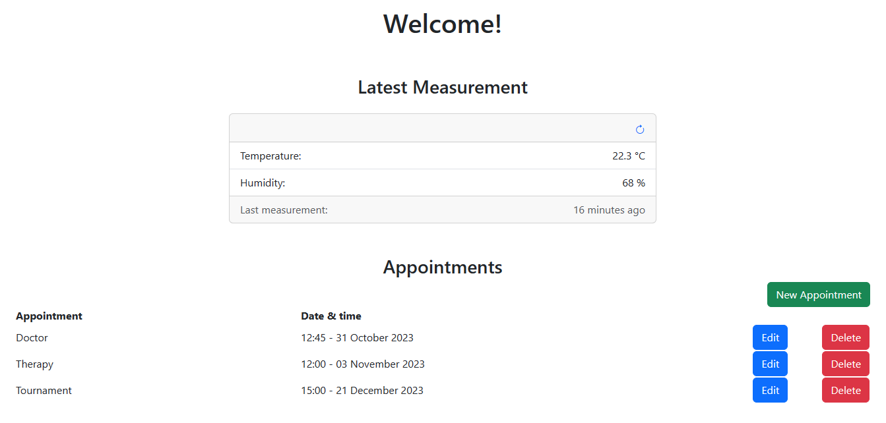
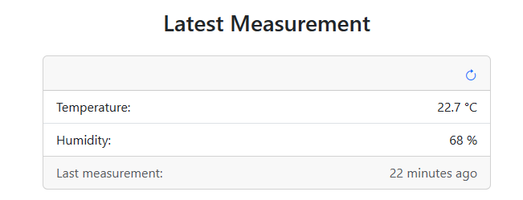
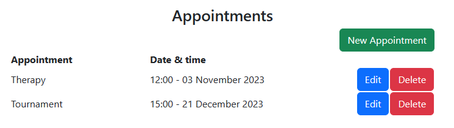
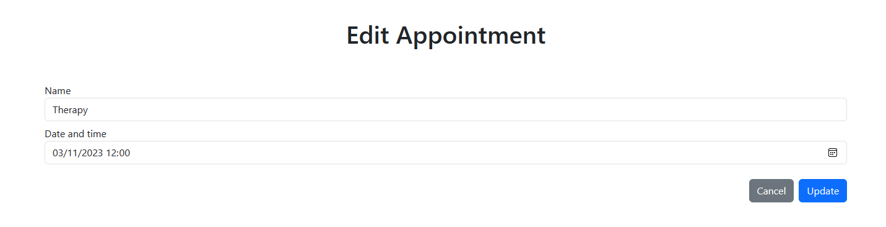

# Code

This page glances over how the code of the web application works. It is not a complete overview of the code, but it
gives a general idea of how the code works. Please check out the code itself for more information.

!!! note
    Link to
    the [code](https://gitlab.fdmci.hva.nl/IoT/2023-2024-semester-1/individual-project/iot-koulenf/-/tree/main/web?ref_type=heads)
    of the web application.

!!! info

    Interested in how the files are structured? Check out the section `Structure of the Website` in the [Technical Documentation](../technical_documentation/)!

## Front-end

### Home Page (index.html)

When the website is loaded,
the [`index.html`](https://gitlab.fdmci.hva.nl/IoT/2023-2024-semester-1/individual-project/iot-koulenf/-/blob/main/web/index.html?ref_type=heads)
page is loaded. This imports contains the Javascript files that are necessary to display the appointments and latest
measurement.

**The Latest Measurement**

To display the latest measurement,
the [`js/measurement/read_latest.js`](https://gitlab.fdmci.hva.nl/IoT/2023-2024-semester-1/individual-project/iot-koulenf/-/blob/main/web/js/measurement/read_latest.js?ref_type=heads)
file is loaded. This file contains functionality to ask the embedded device for a new measurement &
to call the API endpoint to read the latest measurement and the correctly displaying the state on the website by
changing the content of the specified HTML elements and/or hiding/showing HTML elements.
It also contains an event listener that listens for a click on the `Refresh` button. When the button is clicked, the
embedded device is asked for a new measurement again, the API endpoint is called again to read the latest measurement
and the result is displayed on the website.

**Displaying the appointments**

To display the appointments,
the [`js/appointment/read.js`](https://gitlab.fdmci.hva.nl/IoT/2023-2024-semester-1/individual-project/iot-koulenf/-/blob/main/web/js/appointment/read.js?ref_type=heads)
file is loaded. This file contains functionality to call the
API endpoint to read the appointments and then displaying the appointments or an error message on the website by
changing the content of the specified HTML elements and/or hiding/showing HTML elements.

Whenever the `New Appointment` button is clicked, a modal is displayed with a form to create an appointment. This modal
is displayed through the JavaScript of the Bootstrap library. When the form is submitted, the event listener from
[`js/appointment/create.js`](https://gitlab.fdmci.hva.nl/IoT/2023-2024-semester-1/individual-project/iot-koulenf/-/blob/main/web/js/appointment/create.js?ref_type=heads)
is triggered. This event listener calls the API endpoint to create the appointment and then
displays the result on the website by refreshing the page. If an error occurs, the modal will not be closed and an error
message will be displayed.

When the `Delete` button is clicked, the event listener
from [`js/appointment/delete.js`](https://gitlab.fdmci.hva.nl/IoT/2023-2024-semester-1/individual-project/iot-koulenf/-/blob/main/web/js/appointment/delete.js?ref_type=heads)
is triggered. This event listener calls the API endpoint to delete the appointment and then updates the appointment list
by refreshing the page. If an error occurs, an error message will be displayed through an alert.

When the `Edit` button is clicked, the user is redirected to
the [`update.html`](https://gitlab.fdmci.hva.nl/IoT/2023-2024-semester-1/individual-project/iot-koulenf/-/blob/main/web/update.html?ref_type=heads)
page with the appointment ID in the URL.

### Edit Appointment Page (update.html)

The user is redirected to
the [`update.html`](https://gitlab.fdmci.hva.nl/IoT/2023-2024-semester-1/individual-project/iot-koulenf/-/blob/main/web/update.html?ref_type=heads)
page with the appointment ID in the URL when the `Edit` button is clicked on
the [`index.html`](https://gitlab.fdmci.hva.nl/IoT/2023-2024-semester-1/individual-project/iot-koulenf/-/blob/main/web/index.html?ref_type=heads)
page. This page contains the Javascript files that are needed to display the appointment to edit and to
update the appointment.

When
the [`update.html`](https://gitlab.fdmci.hva.nl/IoT/2023-2024-semester-1/individual-project/iot-koulenf/-/blob/main/web/update.html?ref_type=heads)
page is loaded,
the [`js/appointment/read_one.js`](https://gitlab.fdmci.hva.nl/IoT/2023-2024-semester-1/individual-project/iot-koulenf/-/blob/main/web/js/appointment/read_one.js?ref_type=heads)
file is loaded. This file contains functionality to call the API endpoint to read the appointment with the ID from the
URL and then updating the form with the appointment data. If an error occurs, an error message will be displayed and the
form will be hidden.

When the form is submitted, the event listener
from [`js/appointment/update.js`](https://gitlab.fdmci.hva.nl/IoT/2023-2024-semester-1/individual-project/iot-koulenf/-/blob/main/web/js/appointment/update.js?ref_type=heads),
which is also is triggered. This event listener calls the API endpoint to update the appointment and then displays the
result on the website by redirecting the user to
the [`index.html`](https://gitlab.fdmci.hva.nl/IoT/2023-2024-semester-1/individual-project/iot-koulenf/-/blob/main/web/index.html?ref_type=heads)
page. If an error occurs, an error message will be displayed.

## Back-end

The back-end of the website is built with PHP. The PHP files are located in
the [`api`](https://gitlab.fdmci.hva.nl/IoT/2023-2024-semester-1/individual-project/iot-koulenf/-/tree/main/web/api?ref_type=heads)
folder.
The [`api`](https://gitlab.fdmci.hva.nl/IoT/2023-2024-semester-1/individual-project/iot-koulenf/-/tree/main/web/api?ref_type=heads)
folder contains
the following:

- [`api/config/database.php`](https://gitlab.fdmci.hva.nl/IoT/2023-2024-semester-1/individual-project/iot-koulenf/-/blob/main/web/api/config/database.php?ref_type=heads):
  contains the Database class which is used to connect to the database.
- [`api/config/utils.php`](https://gitlab.fdmci.hva.nl/IoT/2023-2024-semester-1/individual-project/iot-koulenf/-/blob/main/web/api/config/utils.php?ref_type=heads):
  contains utility functions that are used in the API endpoints.
- [`api/objects/appointment.php`](https://gitlab.fdmci.hva.nl/IoT/2023-2024-semester-1/individual-project/iot-koulenf/-/blob/main/web/api/objects/appointment.php?ref_type=heads):
  contains the Appointment class with the CRUD functions and SQL queries. To create an
  Appointment object, a Database object is needed in the constructor, which is used to connect to the database.
- [`api/objects/measurement.php`](https://gitlab.fdmci.hva.nl/IoT/2023-2024-semester-1/individual-project/iot-koulenf/-/blob/main/web/api/objects/measurement.php?ref_type=heads):
  contains the Measurement class with the CRUD functions and SQL queries. To create a
  Measurement object, a Database object is needed in the constructor, which is used to connect to the database.

### API Endpoints

The API endpoints are located in
the [`api/appointment`](https://gitlab.fdmci.hva.nl/IoT/2023-2024-semester-1/individual-project/iot-koulenf/-/tree/main/web/api/appointment?ref_type=heads)
and [`api/measurement`](https://gitlab.fdmci.hva.nl/IoT/2023-2024-semester-1/individual-project/iot-koulenf/-/tree/main/web/api/measurement?ref_type=heads)
folders.

In every API endpoint file, the
needed PHP files and classes are included and the needed objects are created to execute the CRUD operations. The correct
headers are also set for each endpoint. The API endpoint then calls the needed CRUD function from the object and returns
the result in JSON format.

The API endpoints are built with the following file structure:

- [`api/appointment/[file].php`](https://gitlab.fdmci.hva.nl/IoT/2023-2024-semester-1/individual-project/iot-koulenf/-/tree/main/web/api/appointment?ref_type=heads):
  contains the API endpoints for the appointments. The `[file]` part of the file name
  indicates the type of the endpoint. The following types are available:
    - `create`: create an appointment
    - `delete`: delete an appointment
    - `read`: read all appointments
    - `read_next_7_days`: read all appointments for the next 7 days
    - `read_one`: read one appointment
    - `update`: update an appointment
- [`api/measurement/[file].php`](https://gitlab.fdmci.hva.nl/IoT/2023-2024-semester-1/individual-project/iot-koulenf/-/tree/main/web/api/measurement?ref_type=heads):
  contains the API endpoints for the measurements. The `[file]` part of the file name
  indicates the type of the endpoint. The following types are available:
    - `create`: create a measurement
    - `read_latest`: read the latest measurement

