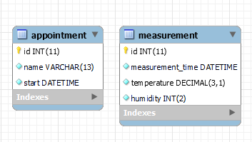
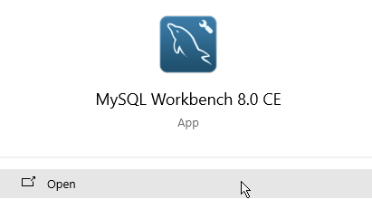
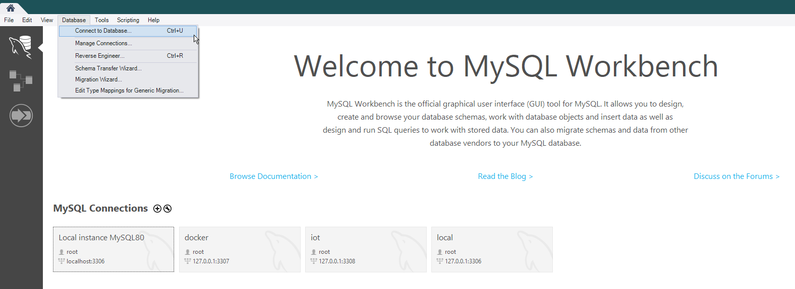
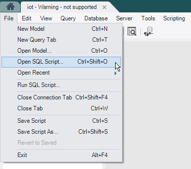
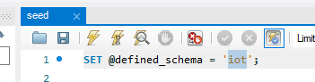
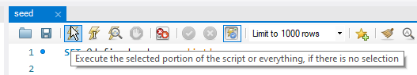

# Database

## Database Diagram

<figure markdown>
  {: style="width:600px"}
</figure>

The database has two tables: `appointment` and `measurement`. The `appointment` table stores the appointments that are
made by the user in the web application. These are then displayed on the LCD screen. The `measurement` table stores the
measurements that are made by the sensor. These are then displayed on the LCD screen as well as in the web application.

### Table `appointment`

The table called `appointment` has the following columns:

| Column | Type        | Nullable | Description                                                                                                                                                                                                                                                                                                                                                            |
|--------|-------------|----------|------------------------------------------------------------------------------------------------------------------------------------------------------------------------------------------------------------------------------------------------------------------------------------------------------------------------------------------------------------------------|
| id     | int(11)     | No       | The primary key of the table. It is an auto incrementing integer. I have chosen for this type because it is a simple way to create a primary key. I first wanted to use a UUID, but I decided against it since it is not supported by MySQL Workbench.                                                                                                                 |
| name   | varchar(13) | No       | The name of the appointment. I have chosen for this type because the name of an appointment should not be longer than 13 characters since the LCD only has 16 characters per line and the name of the appointment is displayed on the first line with a prefix of `[digit]: `. The length of the prefix is 3 so the name of the appointment can be 13 characters long. |
| start  | datetime    | No       | The start date and time of the appointment. I have chosen for this type because it supports storing both the date and time of the appointment in one column. It is stored in UTC.                                                                                                                                                                                      |

### Table `measurement`

The table called `measurement` has the following columns:

| Column           | Type         | Nullable | Description                                                                                                                                                                                                                                                                           |
|------------------|--------------|----------|---------------------------------------------------------------------------------------------------------------------------------------------------------------------------------------------------------------------------------------------------------------------------------------|
| id               | int(11)      | No       | The primary key of the table. It is an auto incrementing integer. I have chosen for this type because it is a simple way to create a primary key. I first wanted to use a UUID, but I decided against it since it is not supported by MySQL Workbench.                                |
| measurement_time | datetime     | No       | The time of the measurement. I have chosen for this type because it supports storing both the date and time of the measurement in one column. It is stored in UTC.                                                                                                                    |
| temperature      | decimal(3,1) | No       | The temperature at the time of measurement. I have chosen for this type because it supports storing a temperature with one decimal. The temperature is of length 3 with precision 1 since the sensor can only measure temperatures between 0 and 50 degrees Celsius with one decimal. |
| humidity         | int(2)       | No       | The humidity at the time of measurement. I have chosen for this type with length 2 because it supports storing an integer and the sensor can only measure between 20 and 90 percent with no decimals.                                                                                 |

## Creating the database

The build script is a SQL script that creates the database called `iot` and the tables called `appointment` and
`measurement`.

### Pre-requisites

- A running MariaDB or MySQL server
- MySQL Workbench
- [Build script](./seed.sql){:download="seed.sql"} (click on the link to download the build script)

### Steps

1. Open MySQL Workbench.  
   {: style="height:150px"}
2. Connect to your MySQL server. You can do this by either clicking on `Database` and then `Connect to Database...` or
   by clicking on one of the connections in the `MySQL Connections` pane.
   {: style="height:300px"}
3. Open the build script in MySQL Workbench. You can do this by clicking on `File` and then `Open SQL Script...`. Then
   navigate to the build script and click on `Open`.  
   {: style="height:300px"}
4. Optional: Change the name of the database in the build script. You can do this by changing the value of the
   variable `defined_schema` on line 1.  
   {: style="height:100px"}
5. Run the build script by clicking on the lightning bolt icon in the toolbar. This will create the database and the
   tables. If you have changed the name of the database, you will have to change the name of the database in the
   .env file as well.  
   {: style="width:600px"}