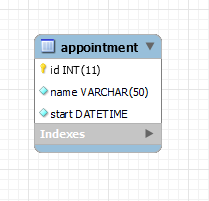

# Database

> Your database should be well documented. On your portfolio you describe how your database is designed and how it
> works. You include a diagram of your database made in MySQL Workbench.

- [ ] The database is normalized into a correct relation database. Tool: MySQL Workbench
- [x] All the tables in the database have a logical and correct primary key.
- [x] The structure of all the columns and tables is in such way that there is no data saved in a wrong format.
- [ ] The build script of your MySQL Database should be stores as .sql files in your portfolio website with detailed
  instructions on how to use.

## Build script

## Database diagram

<figure class="inline end" markdown>
  
  <figcaption>Database diagram</figcaption>
</figure>

The database currently has one table. The table is called `appointments`. The table has the following columns:

- `id` - The primary key of the table. It is an auto incrementing integer. It is not nullable. I have chosen for this
  type because it is a simple way to create a primary key. I first wanted to use a UUID, but I decided against it
  since it is not supported by MySQL Workbench.
- `name` - The name of the appointment. It is of type `varchar(50)`. It is not nullable. I have chosen for this type
  because the name of an appointment should not be longer than 50 characters since the LCD only has 16 characters per
  line.
- `start` - The start date and time of the appointment. It is of type `datetime`. It is not nullable. I have chosen for
  this type because it supports storing both the date and time of the appointment in one column.
